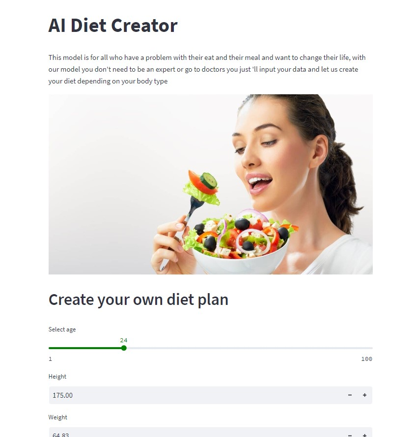
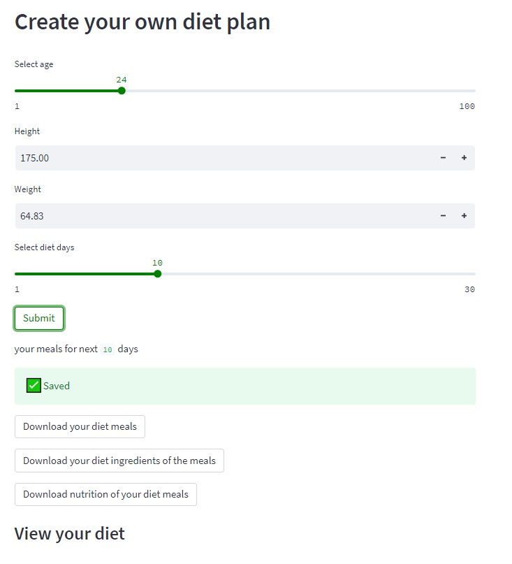
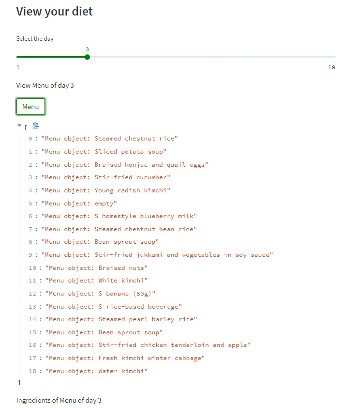
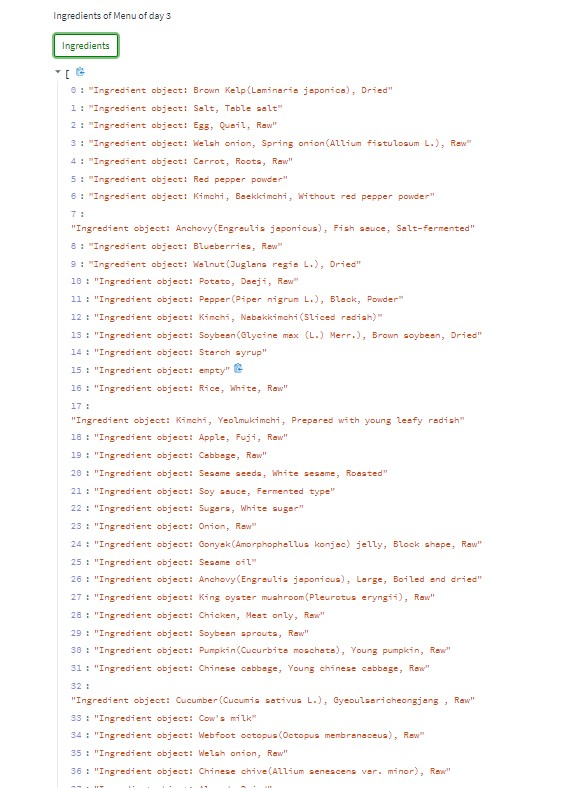
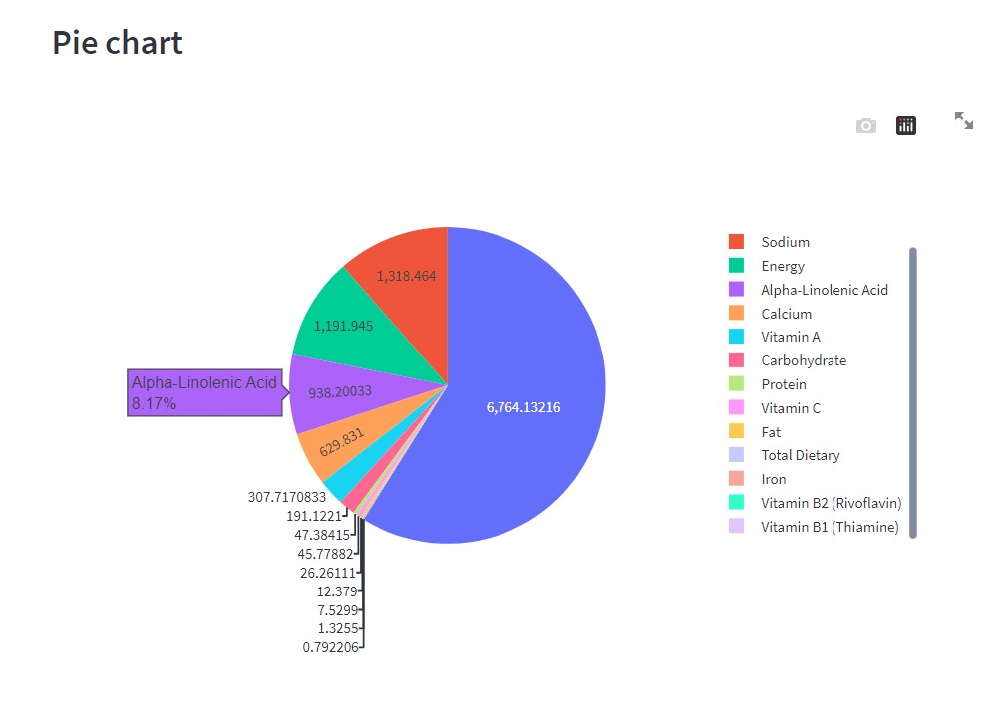

# AI Diet Creator

This model is for all who have a problem with their eat and their meal and want 
to change their lives, with our model you don't need to be an expert or go to 
doctors you just 'll input your data and let us create your diet depending on 
your body type

## samples from the website
### Creating the diet plans

**Download your diet meals, ingradients for these meals and nutritions of meals as csv files**

### View your diet plan after creation
**Viewing menu for the day you chose**

**Viewing the ingredients of the meals**

**Viewing the nutrition value**

## How to open the app
- install requirements from requirements.txt file
- open the file of the project on terminal
- write `streamlit run filename.py` on the terminal

